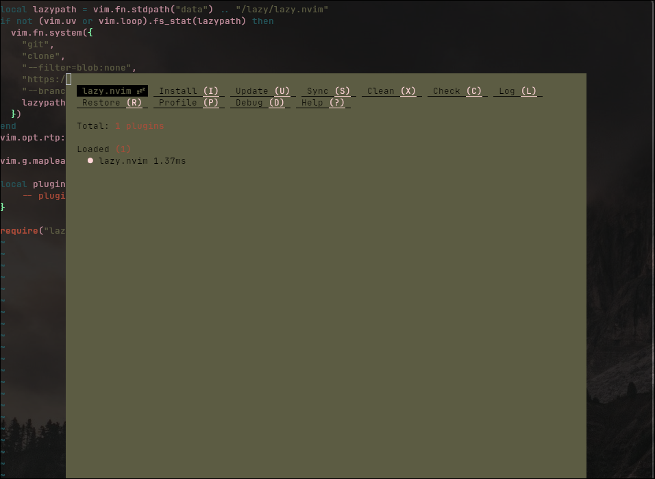

# Setting up Development Environment with NeoVim on Fedora
### Supercharge your development environment for Golang, Rust, TypeScript, Python, C++, and more.

#TODO -- Introduction

I'm not a software engineer. I'm a FOSS enthusiast, a researcher, and data
scientist. This tutorial will help guide those who know very little about
configuring NeoVim, to help them get from text editor to a fully-featured
development environment.

### Downloading NeoVim on Fedora and getting started
To get started, download and install NeoVim on Fedora using dnf:
```bash
sudo dnf install neovim
```

Or build from source:
```bash
# install dependencies
sudo dnf -y install ninja-build cmake gcc make unzip gettext curl glibc-gconv-extra

# clone repo
git clone https://github.com/neovim/neovim
cd neovim

# build and install package
make CMAKE_BUILD_TYPE=Release
sudo make install

```
*to ensure that NeoVim builds correctly, ensure that you have `gcc` and `cmake`
installed.*

After installation, it's time to configure NeoVim, you can do this by creating
the `nvim` directory in your ~/.config directory.
```bash
mkdir ~/.config/nvim 
```
##### The directory structure:
This can be a headache for new users. Inside the `./nvim` directory, the Lua
API/Lazy package manager expect the following files and directories to be
present. 

*this can also be found by typing `:h runtimepath`*

```
./nvim/
    ╰- init.lua
    ╰- after/plugin/
    ╰- lua/config/
        ╰-lazy.lua
```

The `/after` directory contains any files to be loaded after the `init.lua`
script has run. 

The `/lua` directory contains the Lua Plugins. 

Both `/plugin` and `/config` are both directories that will be searched by
NeoVim for runtime files.

## The Lazy package manager. 
Regardless of your desired language(s), the
[Lazy.nvim](https://github.com/folke/lazy.nvim) package manager makes it
incredibly easy to install and manage all of your packages. Inside of your
`~/.config/lua/config/lazy.lua` file, copy the following starter script:

```lua
local lazypath = vim.fn.stdpath("data") .. "/lazy/lazy.nvim"
if not (vim.uv or vim.loop).fs_stat(lazypath) then
  vim.fn.system({
    "git",
    "clone",
    "--filter=blob:none",
    "https://github.com/folke/lazy.nvim.git",
    "--branch=stable", -- latest stable release
    lazypath,
  })
end
vim.opt.rtp:prepend(lazypath)

vim.g.mapleader = " " -- the leader key is used in many keymaps, 

local plugins = {
    -- plugins go here
}

require("lazy").setup(plugins, {})
```

Finally, to invoke this new file, in your `~/.config/nvim/init.lua` file, you
need to include it in your init file:

```lua
require("config.lazy")
```

After saving and closing NeoVim, you will see a screen appear with the Lazy
plugin management interface.

<!-- #TODO -- add screenshot of lazy screen -->



## Add additional plugins:
For any programming language, you will likely want the following plugins:
- [plenary.nvim](https://github.com/nvim-lua/plenary.nvim) -- for additional
functions (including asynchronous requests) in NeoVim.
- [nvim-treesitter](https://github.com/nvim-treesitter/nvim-treesitter) --
provides treesitter support for language parsers, queries, and additional
features like syntax highlighting, indentation, and more.
- [nvim-telescope](https://github.com/nvim-telescope/telescope.nvim) -- a fuzzy
  finder for searching both projects and files. 
- [harpoon](https://github.com/ThePrimeagen/harpoon/tree/harpoon2) -- a ui
  utility for switching between files quickly.
- [undotree](https://github.com/mbbill/undotree) -- a visual representation of
  the changes made to a file, making it easy to switch between undo branches.
- [vim-fugitive](https://github.com/tpope/vim-fugitive) -- to add git
  functionality to your NeoVim experience.
- [lsp-zero](https://github.com/VonHeikemen/lsp-zero) -- While neovim has
  built-in LSP support, lsp-zero is a collection of plugins designed to set up
  features like autocompletion, diagnostics, formatting, and more very easily.
- A color scheme like [NeoSolarized](https://github.com/Tsuzat/NeoSolarized),
  [tokyonight](https://github.com/folke/tokyonight.nvim),
  [papercolor](https://github.com/NLKNguyen/papercolor-theme), or any of the
  [myriad of other themes](https://vimcolorschemes.com/) available.

These plugins can all be added to the plugins list in
`~/.config/nvim/lua/config/lazy.lua`.

```lua
-- partial file

plugins = {
    "nvim-lua/plenary.nvim",
    {"nvim-treesitter/nvim-treesitter", build = ":TSUpdate"},
    {"nvim-telescope/telescope.nvim", tag = '0.1.1', 
        requires = { {"nvim-lua/plenary.nvim"}}},
    {"ThePrimeagen/harpoon", branch = "harpoon2",
        dependencies = {"nvim-lua/plenary.nvim"}},
    "mbbill/undotree",
    "tpope/vim-fugitive",
    --lsp configuration
        {"neovim/nvim-lspconfig"}, --lsp configs
        {"hrsh7th/cmp-nvim-lsp"}, -- autocompletion
        {"hrsh7th/nvim-cmp"}, --additional autocompletion
        {"L3MON4D3/LuaSnip", version = "v2.*", build = "make install_jsregexp", dependencies = {'saadparwaiz1/cmp_luasnip','rafamadriz/friendly-snippets'}, --snippet engine
        {"williamboman/mason.nvim"}, --lsp package manager
        {"williamboman/mason-lspconfig.nvim"}, --lsp package manager configs
    --color scheme, I like NeoSolarized for its support of the transparent terminals like kitty
    {"Tsuzat/NeoSolarized", lazy = false, priority = 1000}, 
}

require("lazy").setup(plugins, {})
```

## Configure the plugins after they are loaded:
After plugins are loaded using Lazy.nvim, NeoVim looks for files in the
`~/.config/nvim/after/plugin/` directory to configure them.

Each of the following sections goes over the configuration for each of the
above plugins.

#### treesitter.lua
```lua
require("nvim-treesitter.configs").setup({
    ensure_installed = {"lua", "python","rust","go", "vimdoc", "c"}, --any language parsers you want installed
    sync_install = false, --if you want to load the parsers synchronously
    auto_install = true,
    highlight = {
        enable = true,
        disable = {}, --include any languages you want to disable highlighting
        disable = function(lang, buf)
            local max_filesize = 100 * 1024 -- 100 KB
            local ok, stats = pcall(vim.loop.fs_stat, vim.api.nvim_buf_get_name(buf))
            if ok and stats and stats.size > max_filesize then
                return true
            end
        end,
        additional_vim_regex_highlighting = false,
    }
})
```

#### telescope.lua
```lua 
local builtin = require("telescope.builtin")
vim.keymap.set('n', '<leader>ff', builtin.find_files, {})
vim.keymap.set('n', '<leader>fg', builtin.git_files, {})
vim.keymap.set('n', '<leader>ps', function()
    builtin.grep_string({search = vim.fn.input(":Grep > ")})
end)
```

This sets the following keymaps for use with telescope as a fuzzy finder:
- leader + ff: Find files
- leader + fg: Find git files
- leader + ps: Grep for string

*keep in mind that you mapped your leader key to `space key` in your `~/.config/nvim/lua/config/lazy.lua`*

#### harpoon.lua
```lua
local harpoon = require("harpoon")

-- REQUIRED
harpoon:setup()
-- REQUIRED

vim.keymap.set("n", "<leader>a", function() harpoon:list():add() end) --add file to end of ui list
vim.keymap.set("n", "<C-e>", function() harpoon.ui:toggle_quick_menu(harpoon:list()) end)

vim.keymap.set("n", "<C-h>", function() harpoon:list():select(1) end)
vim.keymap.set("n", "<C-t>", function() harpoon:list():select(2) end)
vim.keymap.set("n", "<C-n>", function() harpoon:list():select(3) end)
vim.keymap.set("n", "<C-s>", function() harpoon:list():select(4) end)

-- Toggle previous & next buffers stored within Harpoon list
vim.keymap.set("n", "<C-S-P>", function() harpoon:list():prev() end)
vim.keymap.set("n", "<C-S-N>", function() harpoon:list():next() end)
```

#### undotree.lua
```lua
vim.keymap.set("n", "<leader>u", vim.cmd.UndotreeToggle)
```

This sets `leader + u` to open the undotree ui.


This runs the setup for the mason LSP manager and the LSP configs.

#### colors.lua
```lua
local okay_status, NeoSolarized = pcall(require, "NeoSolarized")
if not okay_status then
  return
end

NeoSolarized.setup({
	style="dark",
	transparent=true,
	terminal_colors=true,
	enable_italics=true,
	syles = {
		comment = { italic = true },
		keyword = { italic = true },
		functions = { bold = true },
		variables = {},
		string = {italic = true},
		underline=true,
		undercurl=true,
	},
	on_highlights = function (highlights, colors)
		-- if you leave the visual defaults, visual highlights are invisible
		highlights.Visual = {
			bg = '#eee8d5',
			fg = '#839496'
		}
	end,
 })

local function bg_opacity()
	local clr = "NeoSolarized"
	vim.cmd.colorscheme(clr)
	vim.opt.background = "dark"
	vim.api.nvim_set_hl(0, "Normal", {bg = "none"})
	vim.api.nvim_set_hl(0, "NormalFloat", {bg = "none"})
end

bg_opacity()
```

This loads the colorscheme NeoSolarized, changes the visual highlight defaults,
and creates transparency in the terminal. 

#### lsp.lua
```lua
require("mason").setup({})
require("mason-lspconfig").setup({
    handlers = {
        function(server_name)
            local capabilities = require("cmp_nvim_lsp").default_capabilities()
            require("lspconfig")[server_name].setup({
                capabilities = capabilities
            })
        end,
    },
})
```
This configures the lsp servers. This specific implementation offloads all 
setup and management to mason.

#### cmp.lua
```lua
local cmp = require("cmp")

require('luasnip.loaders.from_vscode').lazy_load()

setusetup({
    snippet = {
        expand = function(args)
            require('luasnip').lsp_expand(args.body)
        end,
    },
    window = {
        completion = cmp.config.window.bordered(),
        documentation = cmp.config.window.bordered(),
    },
    mapping = cmp.mapping.preset.insert({
        --insert custom maps here
    }),
    sources = cmp.config.sources({
        {name = 'nvim_lsp'},
        {name = 'luasnip'},
    }, {
        {name = 'buffer'},
    })
})
```
Now that you have base functionality, it's time to tailor this setup for a
low-level language like Rust.

## Language-Specific Plugins and Configuration
Let's use Rust as the first example. Although I will include languages as
python, TypeScript, and Golang below. 

#### Install plugins
The two plugins to download are:
- [rustacean.nvim](
