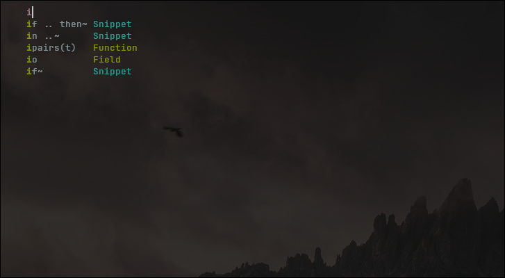
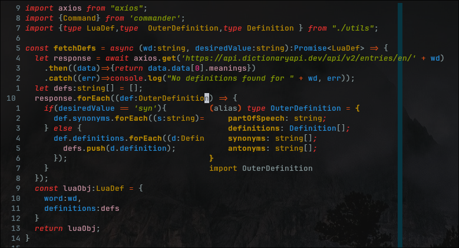

# Setting up Development Environment with NeoVim on Fedora
### Supercharge your development environment for Rust, TypeScript, Python, and more.


### Downloading NeoVim on Fedora and getting started
To get started, download and install NeoVim on Fedora using dnf:
```bash
sudo dnf install neovim
```

Or build from source:
```bash
# install dependencies
sudo dnf -y install ninja-build cmake gcc make unzip gettext curl glibc-gconv-extra

# clone repo
git clone https://github.com/neovim/neovim
cd neovim

# build and install package
make CMAKE_BUILD_TYPE=Release
sudo make install

```
*to ensure that NeoVim builds correctly, ensure that you have `gcc` and `cmake`
installed.*

After installation, it's time to configure NeoVim, you can do this by creating
the `nvim` directory in your `~/.config` directory.
```bash
mkdir ~/.config/nvim 
```
##### The directory structure:
This can be a headache for new users. Inside the `~/.config/nvim` directory, both the Lua
API and the Lazy package manager expect the following files and directories to be
present. 

*the list of searched-for directories can also be found by typing `:h runtimepath`*

```
~/.config/nvim/
            ╰- init.lua
            ╰- after/plugin/
            ╰- lua/config/
                         ╰-lazy.lua
```

The `/after` directory contains any files to be loaded after the `init.lua`
script has run. 

The `/lua` directory contains the Lua Plugins. 

Both `/plugin` and `/config` are both directories that will be searched by
NeoVim for runtime files.

## The Lazy package manager. 
Regardless of your desired development language(s), the
[Lazy.nvim](https://github.com/folke/lazy.nvim) package manager makes it
incredibly easy to install and manage all of your packages. Inside of your
`~/.config/lua/config/lazy.lua` file, copy the following starter script:

```lua
local lazypath = vim.fn.stdpath("data") .. "/lazy/lazy.nvim"
if not (vim.uv or vim.loop).fs_stat(lazypath) then
  vim.fn.system({
    "git",
    "clone",
    "--filter=blob:none",
    "https://github.com/folke/lazy.nvim.git",
    "--branch=stable", -- latest stable release
    lazypath,
  })
end
vim.opt.rtp:prepend(lazypath)

vim.g.mapleader = " " -- the leader key is used in many keymaps, 

local plugins = {
    -- plugins go here
}

require("lazy").setup(plugins, {})
```

Finally, to invoke this new file, in your `~/.config/nvim/init.lua` file, you
need to include it in your init file:

```lua
require("config.lazy")
```

After saving and closing NeoVim, you will see a screen appear with the Lazy
plugin management interface.


## Add additional plugins:
For any programming language, you will likely want the following plugins:
- [plenary.nvim](https://github.com/nvim-lua/plenary.nvim) -- for additional
functions (including asynchronous requests) in NeoVim.
- [nvim-treesitter](https://github.com/nvim-treesitter/nvim-treesitter) --
provides treesitter support for language parsers, queries, and additional
features like syntax highlighting, indentation, and more.
- [nvim-telescope](https://github.com/nvim-telescope/telescope.nvim) -- a fuzzy
  finder for searching both projects and files. 
- [harpoon](https://github.com/ThePrimeagen/harpoon/tree/harpoon2) -- a ui/cli
  utility for switching between files quickly.
- [undotree](https://github.com/mbbill/undotree) -- a visual representation of
  the changes made to a file, making it easy to switch between undo branches.
- [vim-fugitive](https://github.com/tpope/vim-fugitive) -- to add git
  functionality to your NeoVim experience.
- [mason.nvim](https://github.com/williamboman/mason.nvim) for managing language servers (lsp).
- A color scheme like [NeoSolarized](https://github.com/Tsuzat/NeoSolarized),
  [tokyonight](https://github.com/folke/tokyonight.nvim),
  [papercolor](https://github.com/NLKNguyen/papercolor-theme), or any of the
  [myriad of other themes](https://vimcolorschemes.com/) available.

These plugins can all be added to the plugins list in
`~/.config/nvim/lua/config/lazy.lua`.

```lua
-- partial file

plugins = {
    "nvim-lua/plenary.nvim",
    {"nvim-treesitter/nvim-treesitter", build = ":TSUpdate"},
    {"nvim-telescope/telescope.nvim", tag = '0.1.6', 
        requires = { {"nvim-lua/plenary.nvim"}}},
    {"ThePrimeagen/harpoon", branch = "harpoon2",
        dependencies = {"nvim-lua/plenary.nvim"}},
    "mbbill/undotree",
    "tpope/vim-fugitive",
    --lsp configuration
        {"neovim/nvim-lspconfig"}, --lsp configs
        {"hrsh7th/cmp-nvim-lsp"}, -- autocompletion
        {"hrsh7th/nvim-cmp"}, --additional autocompletion
        {"L3MON4D3/LuaSnip", version = "v2.*", build = "make install_jsregexp", dependencies = {'saadparwaiz1/cmp_luasnip','rafamadriz/friendly-snippets'}}, --snippet engine
        {"williamboman/mason.nvim"}, --lsp package manager
        {"williamboman/mason-lspconfig.nvim"}, --lsp package manager configs
    --color scheme 
    {'rebelot/kanagawa.nvim'}, 
}

require("lazy").setup(plugins, {})
```
After closing and reopening NeoVim, you will find that the lazy package manager
is downloading all of the above plugins.


## Configure the plugins after they are loaded:
After plugins are loaded using Lazy.nvim, NeoVim looks for files in the
`~/.config/nvim/after/plugin/` directory to configure them.

### [](treesitter) treesitter.lua
```lua
require("nvim-treesitter.configs").setup({
    ensure_installed = {"lua", "python","rust","go", "vimdoc", "c"}, --any language parsers you want installed
    sync_install = false, --if you want to load the parsers synchronously
    auto_install = true,
    highlight = {
        enable = true,
        disable = {}, --include any languages you want to disable highlighting
        disable = function(lang, buf)
            local max_filesize = 100 * 1024 -- 100 KB
            local ok, stats = pcall(vim.loop.fs_stat, vim.api.nvim_buf_get_name(buf))
            if ok and stats and stats.size > max_filesize then
                return true
            end
        end,
        additional_vim_regex_highlighting = false,
    }
})
```

### [](telescope) telescope.lua 
```lua 
local builtin = require("telescope.builtin")
vim.keymap.set('n', '<leader>ff', builtin.find_files, {})
vim.keymap.set('n', '<leader>fg', builtin.git_files, {})
vim.keymap.set('n', '<leader>ps', function()
    builtin.grep_string({search = vim.fn.input(":Grep > ")})
end)
```

This sets the following keymaps for use with telescope as a fuzzy finder:
- `leader + ff`: Find files
- `leader + fg`: Find git files
- `leader + ps`: Grep for string

*keep in mind that you mapped your leader key to `space key` in your `~/.config/nvim/lua/config/lazy.lua`*

### harpoon.lua
```lua
local harpoon = require("harpoon")

-- REQUIRED
harpoon:setup()
-- REQUIRED

vim.keymap.set("n", "<leader>a", function() harpoon:list():add() end) --add file to end of ui list
vim.keymap.set("n", "<C-e>", function() harpoon.ui:toggle_quick_menu(harpoon:list()) end)

vim.keymap.set("n", "<C-h>", function() harpoon:list():select(1) end)
vim.keymap.set("n", "<C-t>", function() harpoon:list():select(2) end)
vim.keymap.set("n", "<C-n>", function() harpoon:list():select(3) end)
vim.keymap.set("n", "<C-s>", function() harpoon:list():select(4) end)

-- Toggle previous & next buffers stored within Harpoon list
vim.keymap.set("n", "<C-S-P>", function() harpoon:list():prev() end)
vim.keymap.set("n", "<C-S-N>", function() harpoon:list():next() end)
```

### undotree.lua
```lua
vim.keymap.set("n", "<leader>u", vim.cmd.UndotreeToggle)
```

This sets `leader + u` to open the undotree ui.


### colors.lua

This file can be as simple as setting the colorscheme, or as complex as
changing individual components.

#### Simple Configuration
```lua
-- assuming you decided to add {'rebelot/kanagawa.nvim'} to your lazy.lua file for your colorscheme

vim.cmd.colorscheme('kanagawa')
```

#### More Complex Configuration
```lua
local okay_status, NeoSolarized = pcall(require, "NeoSolarized")
if not okay_status then
  return
end

NeoSolarized.setup({
	style="dark",
	transparent=true,
	terminal_colors=true,
	enable_italics=true,
	syles = {
		comment = { italic = true },
		keyword = { italic = true },
		functions = { bold = true },
		variables = {},
		string = {italic = true},
		underline=true,
		undercurl=true,
	},
	on_highlights = function (highlights, colors)
		-- if you leave the visual defaults, visual highlights are invisible
		highlights.Visual = {
			bg = '#eee8d5',
			fg = '#839496'
		}
	end,
 })

local function color_and_bg_opacity()
	local color = "NeoSolarized"
	vim.cmd.colorscheme(color) -- set colorscheme
	vim.opt.background = "dark"
	vim.api.nvim_set_hl(0, "Normal", {bg = "none"}) -- set transparent bg
	vim.api.nvim_set_hl(0, "NormalFloat", {bg = "none"}) -- set transparent bg
end

color_and_bg_opacity()
```

This loads the colorscheme NeoSolarized, changes the visual highlight defaults,
and creates transparency in the terminal. 

#### lsp.lua
```lua
require("mason").setup({})
require("mason-lspconfig").setup({
    handlers = {
        function(server_name)
            local capabilities = require("cmp_nvim_lsp").default_capabilities()
            require("lspconfig")[server_name].setup({
                capabilities = capabilities
            })
        end,
    },
})

vim.api.nvim_create_autocmd("LspAttach", {
    callback = function(args)
        local bufnr = args.buf
        local opts = {buffer = bufnr, remap = false}
		vim.keymap.set("n","gd",function() vim.lsp.buf.definition() end, opts) --go to definition
		vim.keymap.set('n','K',function() vim.lsp.buf.hover() end, opts) -- hover
		vim.keymap.set('n','<leader>vws', function() vim.lsp.buf.workspace_symbol() end, opts) --view workspace
		vim.keymap.set('n','<leader>vd', function() vim.diagnostic.open_foat() end, opts) --view diagnostic
		vim.keymap.set('n','[d',function() vim.diagnostic.goto_next() end, opts)
		vim.keymap.set('n',']d',function() vim.diagnostic.goto_prev() end, opts)
		vim.keymap.set('n','<leader>vca', function() vim.lsp.buf.code_action() end, opts) --view code action
		vim.keymap.set('n','<leader>vrn', function() vim.lsp.buf.rename() end, opts) --rename variables
		vim.keymap.set('n','<leader>vrr', function() vim.lsp.buf.references() end, opts)
		vim.keymap.set('i','<leader>h', function() vim.lsp.buf.signature_help() end, opts)
    end
})

```
This configures the LSP servers. This specific implementation offloads all 
setup and management to mason. 

When a file is opened, the parsers provided by treesitter trigger the LSP to
attach to the buffer. The above autocmd configures the keymaps for the LSP to
the following:
- `gd` - go to definition
- `K` - Hover
- `<leader>vws` - view workspace
- `<leader>vd` - view diagnostic
- `[d` - next diagnostic
- `]d` - previous diagnostic
- `<leader>vca` - view code action
- `<leader>vrn` - rename variables
- `<leader>vrr` - view references
- `<leader>h` - view signature help 

#### cmp.lua
```lua
local cmp = require("cmp")

require('luasnip.loaders.from_vscode').lazy_load()

cmp.setup({
    snippet = {
        expand = function(args)
            require('luasnip').lsp_expand(args.body)
        end,
    },
    window = {
        -- uncomment the following if you want bordered completion options
        -- completion = cmp.config.window.bordered(),
        -- documentation = cmp.config.window.bordered(),
    },
    mapping = cmp.mapping.preset.insert({
	    ['<C-p>'] = cmp.mapping.select_prev_item({select = true}),
	    ['<C-n>'] = cmp.mapping.select_next_item({select = true}),
	    ['<C-Space>'] = cmp.mapping.complete(),
	    ['<C-y>'] = cmp.mapping.confirm({select = true}),
    }),
    sources = cmp.config.sources({
        {name = 'nvim_lsp'},
        {name = 'luasnip'},
    }, {
        {name = 'buffer'},
    })
})
```
*There are **many ways** to configure lsp and completion support. From loading
each server and configuring individual capabilities, to creating custom 
language servers linking them to custom filetypes. This is only meant to show
an easy-to-implement approach.*


Completion has been configured.

The new file structure after loading the plugins and configuring each one looks like this:
```
~/.config/nvim/
            ╰- init.lua
            ╰- after/plugin/
                           ╰- cmp.lua
                           ╰- colors.lua
                           ╰- harpoon.lua
                           ╰- lsp.lua
                           ╰- telescope.lua
                           ╰- treesitter.lua
                           ╰- undotree.lua
            ╰- lua/config/
                         ╰-lazy.lua
```

## Language-Specific Plugins and Configuration
One of the wonderful parts of setting up NeoVim for your specific workflow and
language(s) is its customizability. How you interact with your codebase in
entirely up to you. Such a blank canvas can be daunting. So I've prepared a few
examples of configuration to get you started.

## Rust
### Install Rust if you haven't already using `rustup`.
```bash
## install rustup if you haven't already on Fedora
curl --proto '=https' --tlsv1.2 -sSf https://sh.rustup.rs | sh -s -- --default-toolchain none -y

## after installation of rustup, install the nightly (or stable) toolchain and component clippy
rustup toolchain install nightly --allow-downgrade --profile minimal --component clippy

## finally, install the rust-analyzer LSP from rustup
rustup component add rust-analyzer
```
### LSP
When writing Rust in neovim using `rustaceanvim`, it's important to avoid installing
rust-analyzer via Mason, instead, use the `rustup component add rust-analyzer`
command above. This will properly install the LSP to function with `rustaceanvim
plugin`. This avoids downloading the rust-analyzer with the wrong toolchain.

#### Load plugins
The two plugins to download are:
- [rustaceanvim](https://github.com/mrcjkb/rustaceanvim) for a host of extra
  tools, including lsp, man pages, advanced running capabilities and more.
- [nvim-dap](https://github.com/mfussenegger/nvim-dap) (Debug Adapter Protocol)
  for added debugging capabilities.

To load the plugins, add them to the `plugins` section of the `~/.config/nvim/lua/config/lazy.lua` file.
```lua
--- partial file
-- ~/.config/nvim/lua/config/lazy.lua

plugins = {
    "nvim-lua/plenary.nvim",
	{"nvim-treesitter/nvim-treesitter", build = ":TSUpdate"},
	{"nvim-telescope/telescope.nvim", tag = "0.1.1",
		requires = { {"nvim-lua/plenary.nvim"}}},
	{"ThePrimeagen/harpoon",branch = "harpoon2",
		dependencies = {"nvim-lua/plenary.nvim"}},
	"mbbill/undotree",
	"tpope/vim-fugitive",
	--lsp configuration
		{"neovim/nvim-lspconfig"},
		{"hrsh7th/cmp-nvim-lsp"}, --autocompletion
		{"hrsh7th/nvim-cmp"}, --additional autocompletion
		{"L3MON4D3/LuaSnip", version = "v2.*", build = "make install_jsregexp",
			dependencies = {'saadparwaiz1/cmp_luasnip', 
				'rafamadriz/friendly-snippets'}}, --snippet engine
		{"williamboman/mason.nvim"}, --lsp manager
		{"williamboman/mason-lspconfig.nvim"}, --lsp configs manager
	--colorscheme
	{"Tsuzat/NeoSolarized.nvim",lazy = false, priority=1000},
    -- for Rust programming 
	{'mrcjkb/rustaceanvim', version = '^4', lazy = false},
	{'mfussenegger/nvim-dap'},
}

```

#### Configure Plugins
In `.config/nvim/after/plugin/rust.lua` file, below is an example of a FileType
specific remapping to add keymaps on Rust files and interact with `rustaceanvim`.

```lua
-- find local buffer
local bufnr = vim.api.nvim_get_current_buf()

-- FileType specific keymaps
vim.api.nvim_create_autocmd("FileType", {
  pattern = {"rust", "rs", "Rust"},
  callback = function ()
    vim.schedule(function ()
      vim.keymap.set("n", "<leader>rr", ":RustRun<CR>", {buffer = true})
	  --rustaceanvim remaps
		--code actions
		vim.keymap.set("n", "<leader>ca", function ()
		  vim.cmd.RustLsp('codeAction')
		end, {silent = true, buffer = bufnr})
	  -- hover actions
		vim.keymap.set("n", "<leader>K", function ()
			vim.cmd.RustLsp { 'hover', 'actions' }
        end, {silent = true, buffer = bufnr})
	  --explain error
		vim.keymap.set("n", "<leader>e", function ()
		  vim.cmd('explainError')
		    end, {silent = true, buffer = bufnr})
	end)
  end
})
```

This remaps the following for Rust Files:
- `<leader>rr` to the NeoVim terminal command ":RustRun" to run the current file.
- `<leader>ca` to display the codeaction using the Rust LSP.
- `<keader>K` to give the LSP hover capabilities.
- `<leader>e` to explain errors more verbosely.

There are tons of capabilities available to customize on the [useage and features](https://github.com/mrcjkb/rustaceanvim?tab=readme-ov-file#books-usage--features) section of the `rustaceanvim` wiki.

Then, it's time to configure the debugging. We're going to use the [gnu project
debugger (gpd)](https://www.sourceware.org/gdb/) in conjuction with the `nvim-dap` plugin;

In the same `rust.lua` file:
```lua
-- partial file
-- ~/.config/nvim/after/plugins/rust.lua

-- for debugging

local dap = require('dap')
dap.adapters.gdb = {
	type = "executable",
	command = "gdb",
	args = {"-i", "dap"}
}

dap.configurations.rust = {
  {
	name = "Launch",
	type = "gdb", 
	request = "launch",
	program = function()
		return vim.fn.input('Path to executable: ', vim.fn.getcwd() .. '/', 'file')
	end,
	cwd = "${workspaceFolder}",
	stopAtBegginingOfMainSubProgram = false,
  }
}
```
Here's an example of the code-action from rustaceanvim:


## Python
#### Installation
To install Python3 on Fedora, you can either install via `dnf` or build from
source (not shown here).
```bash
### install the latest version of Python3.12 and pip (python package manager) with dnf
sudo dnf install python3.12 python3-pip
```
#### Optional Installation
Common python packages that can be installed via `dnf` include:
- [python3-devel](https://packages.fedoraproject.org/pkgs/python3.12/python3-devel/)
  -- for development headers and libraries.
- [python3-virtualenv](https://packages.fedoraproject.org/pkgs/python-virtualenv/python3-virtualenv/)
  -- for building virtual environments.
- [python3-pandas](https://packages.fedoraproject.org/pkgs/python-pandas/python3-pandas/)
  --for working with structured data in dataframes.
- [python3-numpy](https://packages.fedoraproject.org/pkgs/python-numpy/python3-numpy/)
  -- for working with numerical data in arrays.
```bash
sudo dnf install python3-devel python3-virtualenv python3-pandas python3-numpy
```
#### LSP Support
As a researcher and data scientist, my implementation of Python may be
different than those in the development sphere.

- [pyright](https://github.com/microsoft/pyright) for language server support,
  static type checking, and code completion with `nvim-lsp-cmp`.
    - This can be installed using `:MasonInstall pyright` from the command line
      in NeoVim. 

#### Workflow Specific Configuration
If you are hoping to work in a way similar to R-Programming Language, where you
send commands to a terminal to work with data stored in memory, These two
functions are used to create a python REPL and send selections of code to be
evaluated in the REPL. You can add these to your
`~/.config/nvim/after/plugin/python.lua` file.

```lua
function OpenTerminalBuffer(termType)
    -- open a terminal buffer
    vim.api.nvim_exec2('belowright split | term', {output = true})
    -- save terminal buffer
    local term_buf = vim.api.nvim_get_current_buf()
    vim.api.nvim_chan_send(vim.api.nvim_get_option_value('channel', {buf = term_buf}), termType .. "\r")
end

local function nextLine()
    local current_line = vim.api.nvim_win_get_cursor(0)[1]
	local total_lines = vim.api.nvim_buf_line_count(0)

	for i = current_line+1, total_lines do
		local line_content = vim.api.nvim_buf_get_lines(0, i-1, i, false)[1]
		if line_content:match('^%S') then 
			vim.api.nvim_win_set_cursor(0, {i, 0})
			break
		end
	end
end

function SendToTerminal(opt)
   -- 0: send current line to buffer
   -- 1: send visual selection to buffer
   -- 2: send entire file up to and including current line to buffer
   
   -- extract text from current buffer
   local txt = ''
    if opt == 1 then
        vim.cmd('normal! gv"xy') -- move visual selection to x register
        txt = vim.fn.getreg('x')
    elseif opt == 2 then
        local ln, _ = unpack(vim.api.nvim_win_get_cursor(0))
        local line_txts = vim.api.nvim_buf_get_lines(vim.api.nvim_get_current_buf(), 0, ln, false)
        txt = table.concat(line_txts, '\n')
    else 
        txt = vim.api.nvim_get_current_line()
   end

    -- move cursor to next non-whitespace line
    nextLine()

    -- locate terminal buffer
   local term_buf = nil
   for _, bufnr in ipairs(vim.api.nvim_list_bufs()) do
        if vim.bo[bufnr].buftype == 'terminal' then
            term_buf = bufnr
            break
        end
    end
    if term_buf == nil then
        print('No terminal buffer found')
        return
    end
    
    vim.api.nvim_chan_send(vim.api.nvim_get_option_value('channel', {buf = term_buf}), txt .. "\r")
end

vim.api.nvim_create_autocmd('FileType', {
    pattern = {'python'},
    callback = function()
        vim.schedule(function()
            vim.keymap.set('n', '<leader><leader>py', [[:lua OpenTerminalBuffer("python3")<CR>]])
            vim.keymap.set({'v','x'}, '<BSlash>d', [[:lua SendToTerminal(1)<CR>]])
            vim.keymap.set('n', '<BSlash>d', [[:lua SendToTerminal(0)<CR>]])
            vim.keymap.set('n', '<BSlash>aa', [[:lua SendToTerminal(2)<CR>]])
        end)
    end,
})

```

This creates two functions `OpenTerminalBuffer` and `SendToTerminal`, then
remaps keybindings to the following:
- `<leader><leader>py` to open a python REPL in a terminal buffer.
- `\d` to send a visual selection or visual block to the REPL.
- `\d` to send the current line to the REPL.
- `\aa` to send the entire file up to and including the current line to the
  REPL.


## TypeScript
#### Installation
To install TypeScript support on Fedora, you will need Node.js and npm
(node package manager). (Or comparable runtime like [Bun](https://bun.sh/))
```bash
### if you want to install nodejs and npm directly from the fedora repos
sudo dnf install nodejs npm  

### or install nvm if you want to control which version of nodejs you use (lts vs. latest)
curl -o- https://raw.githubusercontent.com/nvm-sh/nvm/v0.39.1/install.sh | bash
```
If you decide to use `nvm`, you can install the latest version of nodejs with
`nvm install node`, and install the latest version of npm using `nvm
install-latest-npm`. `nvm` is a good option if you are working on projects that
rely on LTS versions of nodejs. You will have to manage updates manually, it
won't update when you use `sudo dnf update`.

Next, install TypeScript either to your project or globally:
```bash
## locally
npm install typescript --save-dev

## globally
npm install -g typescript
```

#### LSP Support
The following LSP's are helpful in writing TypeScript and can be installed with
mason:
- `:MasonInstall tsserver` - TypeScript Language Server for LSP support.
- `:MasonInstall eslint_d` - eslint for linting.


While there are plugins available specifically for typescript like
[typescript-tools.nvim](https://github.com/pmizio/typescript-tools.nvim), I
have found that LSP support is enough for a basic implementation to work in
TypeScript. 
